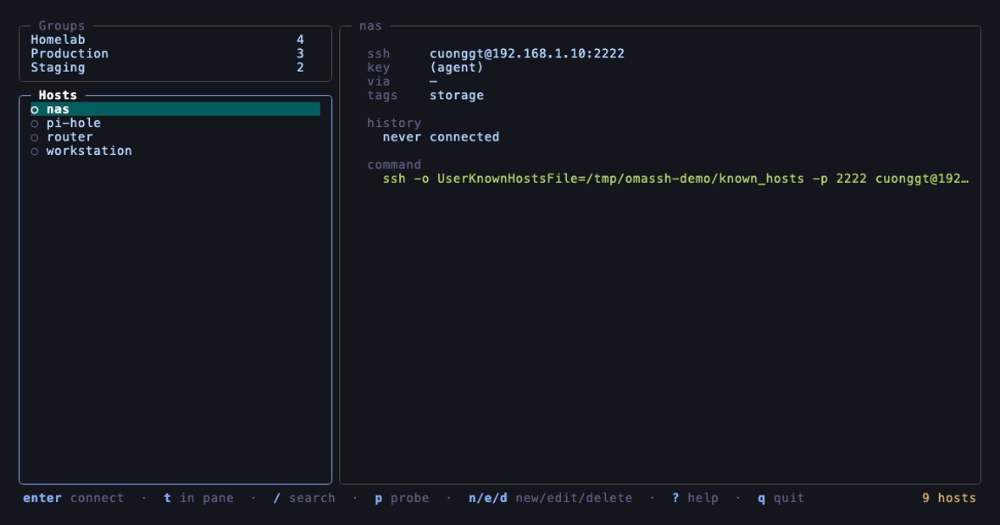

# Omassh

A keyboard-driven SSH client for the terminal — Termius's data model, lazygit's
interaction model, running on top of real OpenSSH.



## Status

Hosts and groups, credentials and SFTP, plus theming, rebindable keys and
reachability probes.

## Keys

| key | |
|---|---|
| `j`/`k`, `tab`, `1`/`2` | move and switch panel |
| `enter` | connect — the session opens in the main pane |
| `o` | hand the whole terminal to `ssh` instead |
| `/` | fuzzy search every host by name, address or tag |
| `n` / `e` / `d` | new / edit / delete |
| `i` | import an `ssh_config` host so it can be edited |
| `K` | credentials: keys, stored secrets, ssh-agent |
| `p` | probe reachability of the hosts in this group |
| `ctrl+l` | redraw, if the terminal cleared the screen underneath |
| `t` | connect, from whichever panel has focus |
| `s` | sftp: browse and transfer files |
| `r` | reload store and re-read `~/.ssh/config` |
| `?` | help |

## Design

Omassh does not reimplement SSH. Interactive sessions are genuine OpenSSH
processes handed the real terminal via `tea.Exec`, so scrollback, `SIGWINCH`,
mouse reporting and full-screen remote programs behave exactly as they would
without Omassh in the picture. `ProxyJump`, certificates, `Match` blocks and
agent config are honoured because OpenSSH itself is honouring them.

`internal/sshx.Build` is the single place any ssh invocation is constructed —
sessions, probes and the native SFTP dialer all funnel through
it, so connection behaviour cannot drift between them.

Secrets never enter the database. A credential record holds a name, a login
user and a key path; the passphrase lives in the OS keychain under the
credential's id. Unlocking a key runs the real `ssh-add`, with the passphrase
handed over through an `SSH_ASKPASS` helper on a single-use unix socket in a
0700 directory — it never appears in an environment variable, a command line,
or a file. Run with `-secrets=memory` to keep secrets in the process only.

`enter` opens a session in the **main pane**, with the host list still beside
it. There is one session at a time, so connecting somewhere else replaces it
rather than leaving a connection nothing in the interface can reach; a green
`●` marks the host it is on.

While that pane has focus every key goes to the remote, so `ctrl+\ w` hands
the keyboard back to the list — the session stays connected and visible —
`ctrl+\ d` detaches and `ctrl+\ X` ends it for good.

Sessions are **persistent** where tmux is installed. A pty whose master belongs
to Omassh dies with it, so each session is instead run as
`tmux new-session -A -s omassh-<host> ssh …` on a private tmux server — closing
Omassh detaches rather than disconnects, and reconnecting reattaches with the
screen and shell state intact. A yellow `●` beside a host means a session is
waiting to be reattached. Without tmux, sessions are ephemeral as before. Those sessions live on their own server socket, so `tmux ls` in your
shell is unaffected.

Scrollback is `ctrl+\ k` and `ctrl+\ j` to page, `ctrl+\ G` to return live;
typing anything snaps back on its own, since a terminal that stayed scrolled
while you typed would hide your own output. For persistent sessions the history
belongs to tmux — 10000 lines, surviving restarts — and those keys drive its
copy mode. Without tmux the emulator keeps 2000 lines itself.

`o` hands the whole terminal to `ssh` instead. That path is emulation-free and
remains the highest-fidelity way to work on a single host.

A pty runs `ssh`, its output feeds a VT emulator, and keys go back the other
way, so the remote gets a real terminal the size of the pane, `SIGWINCH` and
all.

Once a session has focus every keystroke belongs to the remote, `ctrl+c`
included — which is why the session commands sit behind a `ctrl+\` prefix, the
way tmux uses `ctrl+b`. Press the prefix twice to send a literal one through.

SFTP needs no SSH client of its own. Omassh runs `ssh -s <host> sftp` and
speaks the SFTP protocol over that child's stdio, so OpenSSH performs the
connection exactly as it would for an interactive session — `ProxyJump`
chains, `ProxyCommand`, certificates, `Match` blocks, `IdentityAgent` and
`known_hosts` all apply, with no second implementation to keep in step.
`BatchMode` is forced on, because the child's stdin carries the protocol and
there is nowhere to prompt; unlock a credential into the agent first.

Hosts defined in `~/.ssh/config` are read live on every load rather than copied
into the store, so Omassh can never show a stale version of a file you edit by
hand. They are badged `cfg` and are read-only; `i` imports an editable copy
without touching the file. Includes are expanded in place, preserving OpenSSH's
first-match-wins ordering.

## Install

Nothing is published yet. From source:

```sh
go install github.com/cuonggt/omassh/cmd/omassh@latest
```

Releases are built with [GoReleaser](https://goreleaser.com) for macOS and
Linux on both amd64 and arm64. `goreleaser release --snapshot --clean` produces
the archives, checksums and a Homebrew cask locally without publishing.

The demo above is recorded with [VHS](https://github.com/charmbracelet/vhs):

```sh
./hack/demo.sh
```

That starts a throwaway SSH server on loopback so the session pane shows real
shells, seeds a database with sample infrastructure, and drives the UI.

## Run

```sh
go run ./cmd/omassh
```

`enter` connects. `?` lists keys. `q` quits.

`-o` passes an ssh option through to every connection, as `ssh -o` does:

```sh
go run ./cmd/omassh -o ConnectTimeout=5
```

## Configuration

Everything is optional — Omassh runs with no configuration at all. The config
file follows the platform convention, so it is
`~/Library/Application Support/omassh/config.yaml` on macOS and
`~/.config/omassh/config.yaml` on Linux — `omassh -h` prints the resolved path,
and so does the first line of `-print-config`. Writing to the wrong one is
silent, since a missing config is not an error, so let the shell work it out:

```sh
cfg=$(omassh -print-config | head -1 | cut -c3-)
mkdir -p "$(dirname "$cfg")" && omassh -print-config > "$cfg"
```

The database sits beside it, as `omassh.db`.

Themes (`tokyonight`, `gruvbox`, `nord`, `mono`, or your own palette), key
bindings and ssh options all live there. A malformed config
is reported at startup rather than ignored, because settings that silently do
nothing are worse than an error that says why. Arrow keys and `ctrl+c` are
reserved and always work, so no config can trap you in the program.

Colours degrade automatically: on a terminal without truecolor the palettes
render in 256 colours, and `mono` exists for terminals with less than that.

## If the screen goes blank

Some terminals clear the screen without telling the application — iTerm2's
`cmd+K` is the common one. Omassh's renderer still believes its last frame is
on screen and writes only the differences, so nothing reappears on its own.
`ctrl+l` forces a full repaint; from inside a session, where `ctrl+l` belongs
to the remote shell, use `ctrl+\ r`.

## Reachability

`p` probes the hosts in the current group with a plain TCP connection —
`●` up, `✖` down. Hosts behind a jump host or a `ProxyCommand` show `◌` and are
skipped rather than guessed at: their address means something only from the far
side of the proxy, so dialling it from here would report on a different machine
entirely.

## License

[MIT](LICENSE) © Cuong Giang
